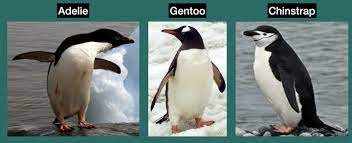
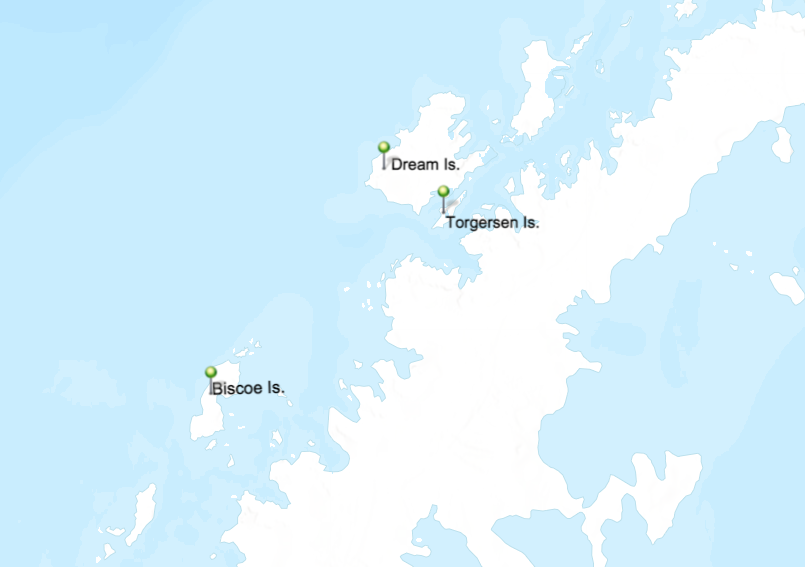

# In-class practice with grouping data

### Your Name (replace me)

### September 16, 2022

Remember: you can reference *Analyze data with R.Rmd* and consult Google for help with commands!

First we need to load the penguin data set, just like last week. The dataset will be called *penguins* This data was collected by real scientists! Data were collected and made available by Dr. Kristen Gorman and the Palmer Station, Antarctica LTER, a member of the Long Term Ecological Research Network.

```{r}
library(palmerpenguins)

penguins

library(tidyverse) # to make tidyverse commands available 
```

1.  Create a vector that is the subset of the data with only penguins that live on Torgersen. How many penguins is this?

```{r}

```

2.  Of the penguins that live on Torgersen, how many have flippers shorter than 190mm?

```{r}

```

3.  Of the penguins that live on Torgersen, what percentage are female?

```{r}

```

There are three different species of penguins in this dataset. We can see from the photo below that they may have different body dimensions.

{width="400"}

4.  What is the mean and standard deviation of body mass for each penguin species? (Hint: use group_by/summarize)

```{r}

```

5.  What is the mean and standard deviation of bill length for each penguin species?

```{r}

```

The penguins live on different islands. The islands are different sizes and located in different locations within the Palmer Archipelago. This could affect the avaibility of prey, habitat, etc.

{width="400"} 6. Do the Adelie penguins living on Torgersen Island have a different mean body mass than the Adelie penguins living on Biscoe?

```{r}

```

7.  Do the female Adelie penguins living on Torgersen Island have a different mean body mass than the female Adelie penguins living on Biscoe? Calculate both the mean and standard deviation of body mass for both groups.

```{r}

```

8.  What is the maximum bill depth of penguins for each island?

```{r}

```

9.  What is the percentage of female penguins present in the entire dataset?

```{r}

```

10. During which year did the scientists measure the most penguins? (Hint: how many penguins are in the data set per year)

```{r}

```

11. What species of penguin live on each island?

```{r}

# on Torgersen

# on Biscoe

# on Dream

```
