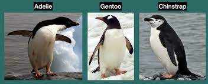
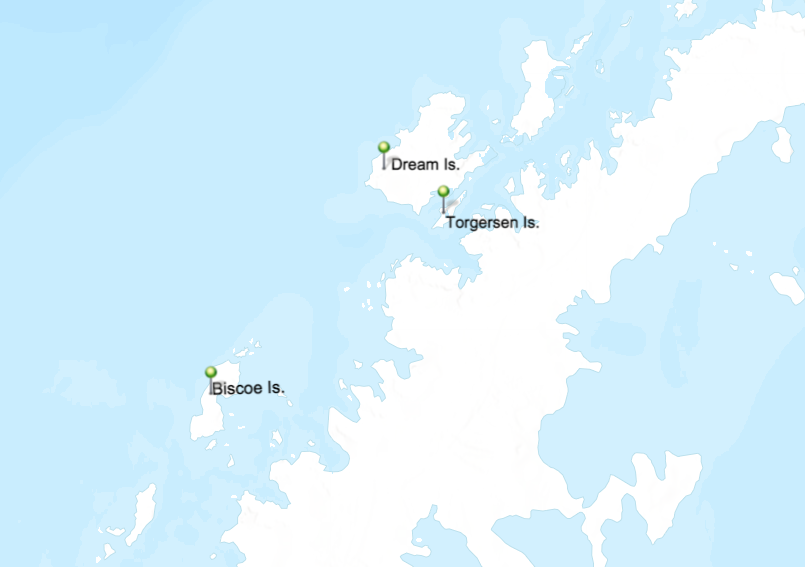

# In-class practice with grouping data

### Your Name (replace me)

### September 16, 2022

Remember: you can reference *Analyze data with R.Rmd* and consult Google for help with commands!

First we need to load the penguin data set, just like last week. The dataset will be called *penguins* This data was collected by real scientists! Data were collected and made available by Dr. Kristen Gorman and the Palmer Station, Antarctica LTER, a member of the Long Term Ecological Research Network.

```{r}
library(palmerpenguins)

penguins

library(tidyverse) # to make tidyverse commands available 
```

1.  Create a vector that is the subset of the data with only penguins that live on Torgersen. How many penguins is this?

```{r}
penguins <- na.omit(penguins)

torg <- filter(penguins, island == "Torgersen")
torg
```

2.  Of the penguins that live on Torgersen, how many have flippers shorter than 190mm?

```{r}
torgShort <- filter(torg, flipper_length_mm < 190)
torgShort

```

3.  Of the penguins that live on Torgersen, what percentage are female?

```{r}

torgFemalePerc <- torg %>% group_by(sex) %>% summarise(percent=n()/nrow(torg))

torgFemalePerc

```

There are three different species of penguins in this dataset. We can see from the photo below that they may have different body dimensions.

{width="400"}

4.  What is the mean and standard deviation of body mass for each penguin species? (Hint: use group_by/summarize)

```{r}

massSummary <- penguins %>% group_by(species) %>% summarize(avgMass=mean(body_mass_g), sdMass=sd(body_mass_g))

massSummary
```

5.  What is the mean and standard deviation of bill length for each penguin species?

```{r}
lengthSummary <- penguins %>% group_by(species) %>% summarize(avgLength=mean(bill_length_mm), sdLength=sd(bill_length_mm))

lengthSummary
```

The penguins live on different islands. The islands are different sizes and located in different locations within the Palmer Archipelago. This could affect the avaibility of prey, habitat, etc.

{width="400"}

6\. Do the Adelie penguins living on Torgersen Island have a different mean body mass than the Adelie penguins living on Biscoe?

```{r}
# one way is using filters and later calulating mass

# first create vectors that are 1. only Adelie on Torgersen and 2. only Adelie on Biscoe
adelieTorgersen <- filter(penguins, island=="Torgersen" & species=="Adelie")
adelieTorgersen
adelieBiscoe <- filter(penguins, island=="Biscoe" & species=="Adelie")
adelieBiscoe

# then caclulate the average mass of each of those subsets
adelieTorgersenMass <- mean(adelieTorgersen$body_mass_g)
adelieTorgersenMass 

adelieBiscoeMass <- mean(adelieBiscoe$body_mass_g)
adelieBiscoeMass


# another way is using group by with multiple criteria, search through the table to find the rows that show Adelies on Torgersen and Biscoe
massByIslandSpecies <- penguins %>% group_by(island, species) %>% summarize(avgMass=mean(body_mass_g), sdMass=sd(body_mass_g))

massByIslandSpecies

```

<<<<<<< HEAD
7.  Do the female Adelie penguins living on Torgersen Island have a different mean body mass than the female Adelie penguins living on Biscoe?

=======
7. Do the female Adelie penguins living on Torgersen Island have a different mean body mass than the female Adelie penguins living on Biscoe? Calculate both the mean and standard deviation of body mass for both groups.
>>>>>>> e2faa9369ecdc2ff60edca8e1e6e7cd23f2bb477
```{r}

# one way is using filters and later calulating mass

# first create vectors that are 1. only Adelie on Torgersen and 2. only Adelie on Biscoe
adelieTorgersenF <- filter(penguins, island=="Torgersen" & species=="Adelie" & sex=="female")
adelieTorgersenF
adelieBiscoeF <- filter(penguins, island=="Biscoe" & species=="Adelie" & sex=="female")
adelieBiscoeF

# then caclulate the average mass of each of those subsets
adelieTorgersenMassF <- mean(adelieTorgersenF$body_mass_g)
adelieTorgersenSdF<-sd(adelieTorgersenF$body_mass_g)
adelieTorgersenMassF
adelieTorgersenSdF

adelieBiscoeMassF <- mean(adelieBiscoeF$body_mass_g)
adelieBiscoeSdF <- sd(adelieBiscoeF$body_mass_g)
adelieBiscoeMassF
adelieBiscoeSdF

```

8.  What is the maximum bill depth of penguins for each island?

```{r}
billByIsland <- penguins %>% group_by(island) %>% summarize(maxDepth=max(bill_depth_mm)) 
billByIsland

```

9.  What is the percentage of female penguins present in the entire dataset?

```{r}
femalePerc <- penguins %>% group_by(sex) %>% summarise(percent=n()/nrow(penguins))

femalePerc

```

10. During which year did the scientists measure the most penguins? (Hint: how many penguins are in the data set per year)

```{r}

yearCounts <- penguins %>% group_by(year) %>% summarize(count=n())
yearCounts

```

11. What species of penguin live on each island?

```{r}
speciesByIsland <- penguins %>% group_by(species) %>% summarize(penguinSp=unique(island)) 
speciesByIsland

# on Torgersen
# Adelie only 

# on Biscoe
# Adelie and Gentoo

# on Dream
#Adelie and Chinstrap

```
