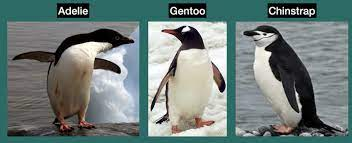
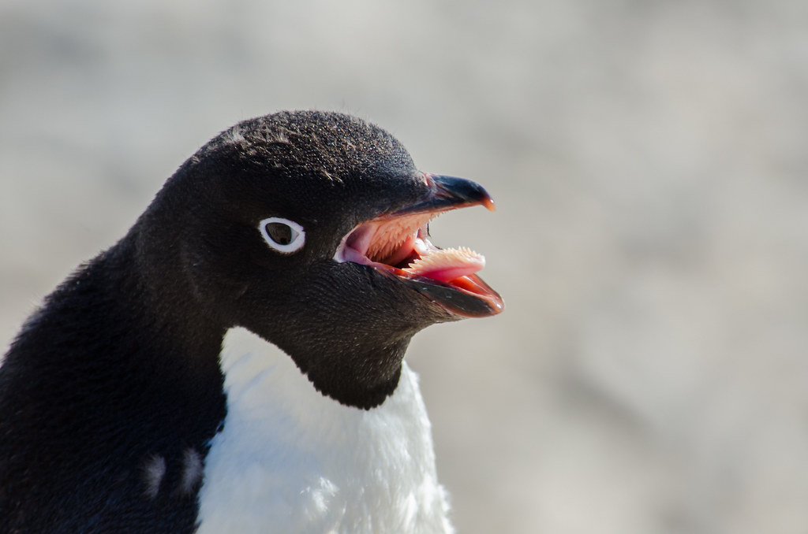
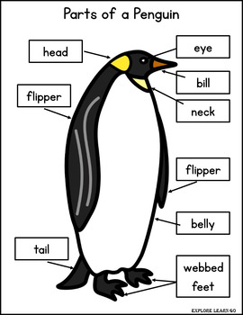

# In-class practice with ggplot

### Your Name (replace me)

### September 30, 2022

For each plot, be sure to give accurate and descriptive labels!

Remember: you can reference *food_gone_bad.Rmd*, the ggplot-cheatsheet.pdf, and consult Google for help with commands!

First we need to load the penguin data set, just like we have before. The dataset will be called *penguins* This data was collected by real scientists! Data were collected and made available by Dr. Kristen Gorman and the Palmer Station, Antarctica LTER, a member of the Long Term Ecological Research Network.

```{r}
library(palmerpenguins)
penguins
library(tidyverse) # to make tidyverse commands available 
```

There are three different species of penguins in this dataset. We can see from the photo below that they may have different body dimensions. We will be using data visualizations to explore some of these differences.

{width="600"}

Remember

1.  Create a histogram of body mass for all penguin species. Using comments, write a description of what this histogram shows.

```{r}

```

2.  Create a histogram of body mass, with each species in a different color. What does this show us about the different species? Which species do you think has the greatest body mass?

```{r}

```

3.  Now let's find out! Create a bar graph with the average body mass for each penguin species. (Don't forget about the NAs in the dataset) Which one has the greatest average body mass? How does that compare with what you thought looking at the histogram?

```{r}

```

4.  Create a visualization that will help answer the question: Do heavier penguins have longer flippers? Think about how many variables you have and the best way to present this data. Color by species.

```{r}

```

{width="300"} {width="300"}

5.  Create a data visualization to explore the question: Do penguins with longer bills tend to have longer flippers as well? Make sure to give the points either different colors or shapes based on the species.

```{r}

```

6.  Create a bar graph that shows the average body mass by sex.

```{r}

```

7.  Create one figure that has three bar graphs: comparing average body mass by sex AND species. If you need a hint, please ask!

```{r}

```

8.  There is so much option in ggplot for customizing your plots and so many interesting relationships between variables to explore! Create any data visualization you like of the palmer penguin dataset, customizing it in at least one way. Here are some online resources for customization <https://ggplot2-book.org/polishing.html>, <http://www.sthda.com/english/wiki/be-awesome-in-ggplot2-a-practical-guide-to-be-highly-effective-r-software-and-data-visualization> (scroll to the bottom to see their style guide).

Think about how many variables you are graphing (one or two), what kind of variables they are (categorical or numerical), and what question your viz will explore!

```{r}

```

9.  Create a a pie chart, showing the percentage of the dataset each penguin species comprises. (you definitely will need to use google). In data science, are pie charts a good idea? Take a look [here](https://medium.com/analytics-vidhya/dont-use-pie-charts-in-data-analysis-6c005723e657), and explain your answer.

```{r}

```
