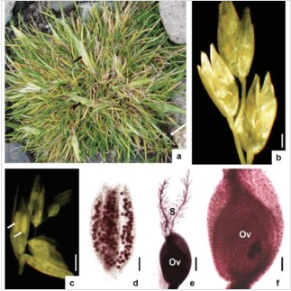

```{r setup, include=FALSE}
knitr::opts_chunk$set(echo = TRUE)
```

# Statistical inference and regression analyses

### Setting up the scenario

We want to build a road to our fishing site, while minimizing our impact on the delicate antarctic ecosystem. For today's lesson, we are going to focus on antarctic hairgrass, one of only two flowering species of plants on the continent.

<https://www.researchgate.net/figure/Morphology-of-Antarctic-hair-grass-Deschampsia-antarctica-a-A-small-cluster-of-D_fig1_304660866>



We want to know what environmental conditions are associated with hairgrass, so we can build a road where those conditions are not. It would take far too long to survey every square inch of land between our base and our fishing spot, so we are going to build a model based on some samples of where hairgrass is found to predict where else it might be.

We collected data for one month on key components of the hairgrass' environment

-   soil pH : most plants prefer mildly acidic to neutral environments

-   nitrogen content (as percentage per 100 mL soil sample) : important for plant growth and tissue building

-   phosphorous content (as percentage per 100 mL soil sample) : important for plant growth and tissue building

-   percent soil rock : rockiness of soil impacts water drainage and temperature

-   max windpseed knots : antarctica is known for extreme wind, so un

-   average UV index :

-   average summer temperature :

-   average winter temperature :

-   penguin density within 100 m :

-   hairgrass density (measured as number of individual clumps of hairgrass within 1 square meter)

(This data is based on this article: I.Yu. Parnikoza, N.Yu. Miryuta, D.N. Maidanyuk, S.A. Loparev, S.G. Korsun, I.G. Budzanivska, T.P. Shevchenko, V.P. Polischuk, V.A. Kunakh, I.A. Kozeretska, Habitat and leaf cytogenetic characteristics of Deschampsia antarctica Desv. in the Maritime Antarctica, Polar Science, Volume 1, Issues 2--4, 2007, Pages 121-128, ISSN 1873-9652, <https://doi.org/10.1016/j.polar.2007.10.002>.)

### Exploring and analyzing our first variable of interest

There are many environmental conditions that may be associated with hairgrass density. For today's code along, we are going to focus on two: soil pH and nitrogen content.

Let's look at soil pH first.

We always should start with a data visualization and some descriptive statistics.

```{r}
# load in the tidyverse
library("tidyverse")
# load in the data
hairgrass <- read_csv("hairgrass_data.csv")
```

```{r}
# What are our independent and dependent variables?
# What kind of variables are they?
# What kind of viz should we do?

hairgrass %>% summarize(max(soil_pH), min(soil_pH), mean(soil_pH), sd(soil_pH))
# okay cool good to know, emphasize we are not doing group by because not categorical data

hairgrass %>% ggplot(aes(x = hairgrass_density_per_m2, y = soil_pH)) +
  geom_jitter() 
  # could do jitter or not, what do other people think?

# do you see a pattern? Do you think these data are correlated? What do you think the correlation coefficient will be?


```

Now let's actually calculate the correlation coefficient.

```{r}
cor(hairgrass$hairgrass_density_per_m2, hairgrass$soil_pH)
# wow that is a pretty low correlation coefficient. Let's see what the line of best fit looks like. What do we expect based on this correlation coefficient?
```

Adding our line of best fit to the data

```{r}
hairgrass %>% ggplot(aes(y = hairgrass_density_per_m2, x = soil_pH)) +
  geom_jitter() +
  geom_smooth(method = "lm")

# is that what we expected based on that correlation coefficient? 
```

If we want to add statistical rigor, we need to use regression analysis. A regression analysis approximates the relationship between a dependent variable and one or more independent variables and evaluates the strength of that relationship (giving us a p-value).

We will use linear regressions in this unit. This simply means that the model will take the form of y = mx + b, where y is the dependent variable, x is the dependent variable, m is the slope, and b is the y-intercept.

What would the model for our question about soil pH be? (it's okay that we haven't yet calculated the values)

```{r}
# hairgrass density = m *  soil_pH + b
```

What is the null hypothesis? What is the alternative hypothesis?

```{r}
# null: There is no relationship between hairgrass density and soil pH
# alt: There is a relationship between hairgrass density and soil pH 

```

R can actually calculate what this model would be for us. The formula for the line of best fit (y = mx+b) aims to minimize the distance between each observation (point) and the line. What is the model?

```{r}
summary(lm(hairgrass_density_per_m2 ~ soil_pH, data = hairgrass))
# model: hairgrass density = 7.4 + 0.006 * soil pH
```

So what can we conclude about soil pH and hairgrass density?

```{r}
# stats interpretation
# Because the p-value associated with the F statistic was 0.875, we accept the null hypothesis that there is no relationship between soil pH and hairgrass density. The slope of the line is likely 0.

# interpretation in light of scenario: we shouldn't worry about soil pH as we think about where to build our road

# REMIND everyone how to submit these words so they get counted
```

\-\-\-\-\-\-\-\-\-\-\-\-\-\-\-\-\-\-\-\-\-\-\-\-\-\-\-\-\-\-\-\-\-\-\-\-\-\-\-\-\-\-\-\-\-\-\-\-\-\-\-\-\-\-\-\-\-\-\-\-\-\-\-\-\-\-\-\-\-\-\-\-\-\-\-\-\-\-\-\-\-\-\-\-\-\-\--

If there is time, move on to nitrogen content.

Create a scatterplot of nitrogen content

```{r}

```
